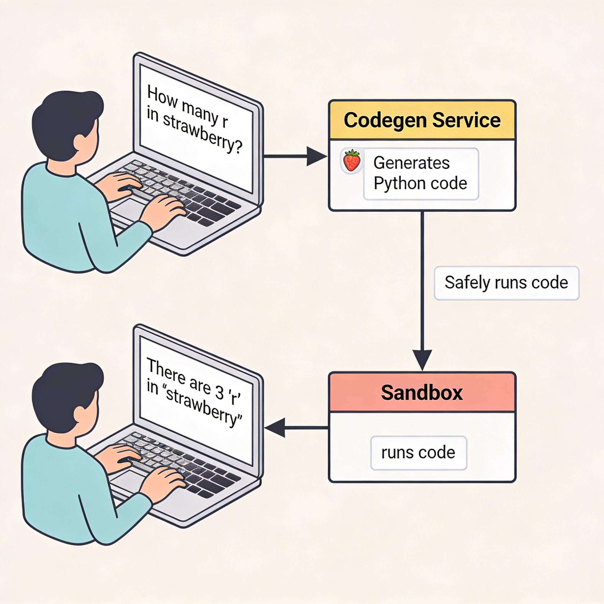

# Factorio Agent

Experiments and recipes for AI agents: multi-agent systems, code-execution sandboxes, and an agentic system for playing Factorio.

## What's in this repo

| Area | Description |
|------|-------------|
| **[Multi-agent systems (Google ADK)](multi-agents/google-adk/README.md)** | Examples built with Google's Agent Development Kit — sub-agents, sequence agents, loop agents — using LiteLLM for inference. |
| **[Coding agents + sandbox](coding_agents/README.md)** | Agent harness that reformulates questions as coding problems, generates code (e.g. Qwen3-Coder), and runs it in a sandboxed environment with resource limits. |
| **[Factorio](factorio/README.md)** | Agentic system that plays Factorio. See the Factorio README for setup. |

## Coding agents: sandbox in action

The coding-agents pipeline runs an LLM-backed codegen service that sends code to a sandbox for execution. Example: *"How many r in strawberry?"* is turned into code, executed, and the result is returned.

For architecture and data flow (including the full "how many r in strawberry?" flow), see [Coding Agents README](coding_agents/README.md).
